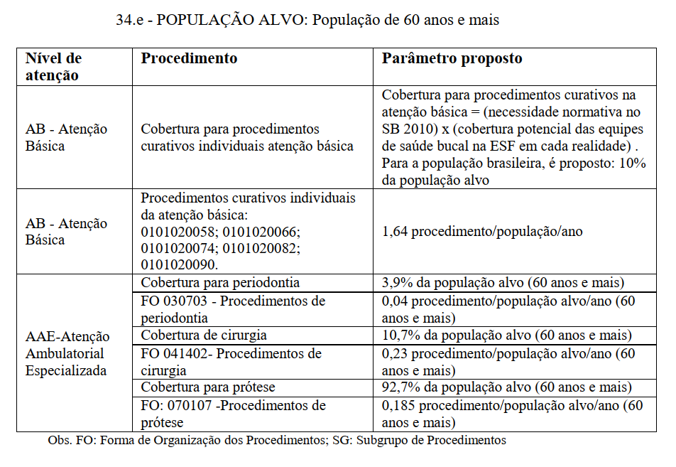

```{r setup, include=FALSE}

options(scipen = 999)

knitr::opts_chunk$set(
	echo = TRUE,
	message = FALSE,
	warning = FALSE
)
library(tidyverse)
library(readxl)

if (!require(RODBC)) { install.packages(RODBC); require(RODBC) }

dremio_host <- "***"
dremio_port <- "***"
dremio_uid <- "***"
dremio_pwd <- Sys.getenv("datalake")

channel <- odbcDriverConnect(sprintf("DRIVER=Dremio Connector;HOST=%s;PORT=%s;UID=%s;PWD=%s;AUTHENTICATIONTYPE=Basic Authentication;CONNECTIONTYPE=Direct", dremio_host, dremio_port, dremio_uid, dremio_pwd))

```

# Pressupostos teóricos 

O presente exercício tem como objetivo testar a aplicação de uma metodologia de planejamento da força de trabalho para a saúde bucal.

Essa é uma metodologia baseada em parâmetros de razão populacional (ex.: 1,5 procedimentos curativos para a população coberta) e utiliza como referência o [caderno de critérios e parâmetros para planejamento de serviços no âmbito do SUS (2017)](https://www.gov.br/saude/pt-br/acesso-a-informacao/gestao-do-sus/programacao-regulacao-controle-e-financiamento-da-mac/programacao-assistencial/arquivos/caderno-1-criterios-e-parametros-assistenciais-1-revisao.pdf). 

De acordo com o caderno de critérios e parâmetros temos algumas previsões sobre a necessidade de procedimentos. A imagem abaixo apresenta tais condições 




Diante dessas informações, depreende-se que alguns dados são necessários para a modelagem:

* Projeções populacionais: nesse caso, utilizaremos as projeções populacionais do IBGE a nível UF, por contarmos com dados até 2030 

* Cobertura de Estratégia de Saúde da Família Saúde Bucal: nesse caso, os dados foram acessados por meio do e-gestor AB 

# Baixando os dados da população 

Para essa metodologia serão necessários dados de população e da cobertura de estratégia de saúde - saúde bucal. 

```{r}

df_sb <- sqlQuery(channel, 'SELECT * FROM "Analytics Layer".Territorial."População SVS por região de saúde e faixa etária"') %>% filter(ANO == 2021 & uf == "Goiás") 


df_cobertura <- read_delim("coberturasb_go.csv", 
    ";", escape_double = FALSE, trim_ws = TRUE)

DT::datatable(df_cobertura)

```


**Vamos utilizar o parâmetro de 24%. Porém, esse é um valor que deverá ser parametrizado no sistema.** 

# Prototipação

Para fins de prototipação, vamos pegar só dados de Goiás para 2021

```{r}

a <- df_sb %>%  
  filter(uf == 'GO') %>% 
  filter(ano >  2019) %>% 
  ggplot(aes(x = ano, y = TOTAL, col = FAIXA_ETARIA)) + geom_line(size = 1) + 
  scale_x_continuous(breaks = seq(2020, 2030, 3)) + theme_minimal()

plotly::ggplotly(a)

```

# Calculando a necessidade em saúde bucal de cada grupo a cada ano 

A cobertura foi estabelecida em 0.24 (24%) visto que, multiplicando-se a taxa de cobertura da eSFSB e o SB2010 (48%), tivemos esse valor aproximado nos últimos cinco anos. No entanto, como dito anteriormente, essa cobertura pode ser ajustada. 


## População de 0 a 14 anos
```{r}

df_sb0_14 <- 
  df_sb %>% 
  filter(uf == 'GO') %>% 
  filter(FAIXA_ETARIA == "0 a 14") %>% 
  mutate(cobertura = TOTAL * 0.24) %>% 
  mutate(proced_curativos = 1.5 * cobertura,
         cobertura_endodontia = 0.08 * TOTAL,
         proced_endodontia = 0.1 * cobertura_endodontia) %>% 
  filter(ano > 2019) 

DT::datatable(df_sb0_14 %>% select(-starts_with("cobertura")))

```

```{r}

b <- df_sb0_14 %>% 
  select(-uf, -FAIXA_ETARIA, -cobertura, -TOTAL, -cobertura_endodontia) %>% 
  pivot_longer(
               cols = starts_with("proced"),
               names_to = "procedimento",
               values_to = "total",
               ) %>% 
  ggplot(aes(x = ano, y = total, fill = procedimento)) + geom_col() + 
  #facet_wrap(~procedimento, scales = "free_y") +   
  scale_x_continuous(breaks = seq(2020, 2030, 3)) + 
  theme_minimal()


plotly::ggplotly(b)


```


## População de 15 a 29 anos
```{r}

df_sb15_29 <- 
  df_sb %>% 
  filter(uf == 'GO') %>% 
  filter(FAIXA_ETARIA == "15 a 29") %>% 
  mutate(cobertura = TOTAL * 0.24) %>% 
  mutate(proced_curativos = 2.6 * cobertura,
         cobertura_periodontia = 0.101 * TOTAL,
         proced_periodontia = 0.10 * cobertura_periodontia, 
         cobertura_cirurgia = 0.099 * TOTAL,
         proced_cirurgia = 0.20 * cobertura_cirurgia,
         cobertura_endodontia = 0.1 * TOTAL,
         proced_endodontia = 0.1 * cobertura_endodontia,
         cobertura_protese = 0.137 * TOTAL,
         proced_protese = 0.027 * cobertura_protese) %>% 
  filter(ano > 2019) 

DT::datatable(df_sb15_29 %>% select(-starts_with("cobertura")))

```

```{r}

c <- df_sb15_29 %>% 
  select(-uf, -FAIXA_ETARIA, -cobertura, -TOTAL, -cobertura_endodontia) %>% 
  pivot_longer(
               cols = starts_with("proced"),
               names_to = "procedimento",
               values_to = "total",
               ) %>% 
  ggplot(aes(x = ano, y = total, fill = procedimento)) + geom_col() + 
  theme_minimal() + #facet_wrap(~procedimento, scales = "free_y") + 
  scale_x_continuous(breaks = seq(2020, 2030, 3))


plotly::ggplotly(c)


```


## População de 30 a 59 anos
```{r}

df_sb30_59 <- 
  df_sb %>% 
  filter(uf == 'GO') %>% 
  filter(FAIXA_ETARIA == "30 a 59") %>% 
  mutate(cobertura = TOTAL * 0.24) %>% 
  mutate(proced_curativos = 4.1 * cobertura,
         cobertura_periodontia = 0.179 * TOTAL,
         proced_periodontia = 0.12 * cobertura_periodontia, 
         cobertura_cirurgia = 0.164 * TOTAL,
         proced_cirurgia = 0.32 * cobertura_cirurgia,
         cobertura_endodontia = 0.10 * TOTAL,
         proced_endodontia = 0.11 * cobertura_endodontia,
         cobertura_protese = 0.687 * TOTAL,
         proced_protese = 0.138 * cobertura_protese) %>% 
  filter(ano > 2019) 

DT::datatable(df_sb30_59 %>% select(-starts_with("cobertura")))

```

```{r}

d <- df_sb30_59 %>% 
  select(-uf, -FAIXA_ETARIA, -cobertura, -TOTAL, -cobertura_endodontia) %>% 
  pivot_longer(
               cols = starts_with("proced"),
               names_to = "procedimento",
               values_to = "total",
               ) %>% 
  ggplot(aes(x = ano, y = total, fill = procedimento)) + geom_col() + 
  theme_minimal() + #facet_wrap(~procedimento, scales = "free_y") + 
  scale_x_continuous(breaks = seq(2020, 2030, 3))


plotly::ggplotly(d)


```

## População acima de 60 anos

```{r}

df_sb60 <- 
  df_sb %>% 
  filter(uf == 'GO') %>% 
  filter(FAIXA_ETARIA == "60 ou mais") %>% 
  mutate(cobertura = TOTAL * 0.24) %>% 
  mutate(proced_curativos = 1.64 * cobertura,
         cobertura_periodontia = 0.039 * TOTAL,
         proced_periodontia = 0.04 * cobertura_periodontia, 
         cobertura_cirurgia = 0.107 * TOTAL,
         proced_cirurgia = 0.23 * cobertura_cirurgia,
         cobertura_protese = 0.927 * TOTAL,
         proced_protese = 0.185 * cobertura_protese) %>% 
  filter(ano > 2019) 

DT::datatable(df_sb60 %>% select(-starts_with("cobertura")))

```

```{r}

e <- df_sb60 %>% 
  select(-uf, -FAIXA_ETARIA, -cobertura, -TOTAL) %>% 
  pivot_longer(
               cols = starts_with("proced"),
               names_to = "procedimento",
               values_to = "total",
               ) %>% 
  ggplot(aes(x = ano, y = total, fill = procedimento)) + geom_col() + 
  theme_minimal() + # facet_wrap(~procedimento, scales = "free_y") + 
  scale_x_continuous(breaks = seq(2020, 2030, 3))


plotly::ggplotly(e)


```


Uma vez que é uma metodologia que se baseia especialmente na razão população, a estimativa de demanda por serviços de saúde se modifica de acordo com as dinâmicas demográficas. .


```{r}

df_sb60t <- df_sb60 %>% 
  select(-uf, FAIXA_ETARIA, -starts_with("cobertura"), -TOTAL) %>% 
  pivot_longer(
               cols = starts_with("proced"),
               names_to = "procedimento",
               values_to = "total",
               )

df_sb0_14t <- df_sb0_14 %>% 
  select(-uf, FAIXA_ETARIA, -starts_with("cobertura"), -TOTAL) %>% 
  pivot_longer(
               cols = starts_with("proced"),
               names_to = "procedimento",
               values_to = "total",
               )

df_sb30_59t <- df_sb30_59%>% 
  select(-uf, FAIXA_ETARIA, -starts_with("cobertura"), -TOTAL) %>% 
  pivot_longer(
               cols = starts_with("proced"),
               names_to = "procedimento",
               values_to = "total",
               )

df_sb15_29t <- df_sb15_29 %>% 
  select(-uf, FAIXA_ETARIA, -starts_with("cobertura"), -TOTAL) %>% 
  pivot_longer(
               cols = starts_with("proced"),
               names_to = "procedimento",
               values_to = "total",
               )

df_total <- 
  rbind(df_sb0_14t, df_sb15_29t,
        df_sb30_59t, df_sb60t) %>% 
  mutate(nivel_atencao = if_else(procedimento == "proced_curativos","primario",
                                 "secundario"))


f <- df_total %>%  
  filter(ano == 2020) %>% 
  ggplot(aes(x = procedimento, y = total, fill = FAIXA_ETARIA)) + geom_col(position = "dodge") + 
  coord_flip() + theme_minimal()

plotly::ggplotly(f)

```

Procedimentos 

```{r}
DT::datatable(df_total)
```


# Calculando Oferta
# Tempo de profissionais 

Uma vez que se sabe o total de serviços necessários para endereçar a população considerando as taxas de coberturas e parâmetros do Ministério da Saúde, é possível determinar o número de horas necessário por profissional e, consequentemente, o total de profissionais em equivalente tempo integral (ETI). 


O tempo dos procedimentos ficarão em uma escala de 20 minutos a 40 minutos. 

```{r}

df_total <- 
  df_total %>% 
  mutate(tempo_procedimento = case_when(procedimento == "proced_cirurgia" ~ 1,
                                        procedimento == "proced_curativos" ~ 0.5,
                                        procedimento == "proced_endodontia" ~ 0.5,
                                        procedimento == "proced_periodontia" ~ 0.5,
                                        procedimento == "proced_protese" ~ 0.66)) %>% 
  mutate(tempo_total = tempo_procedimento * total)

# assumimos o tempo máximo (40 minutoss, ou 0,66 horas), mas podemos reparametrizar

```

Agora é importante estimar o tempo médio de um profissional de saúde bucal ao longo de um ano. Considerando uma carga de trabalho de 40h semanais, temos 160 horas mensais. Considerando uma ausência de 40 dias ao ano devido a férias e outras possíveis ausências (atestados, licenças, atrasos), temos, ao longo de um ano 2600 horas de tempo disponível de um profissional. 

```{r}

df_total %>% 
  group_by(ano, nivel_atencao) %>% 
  summarise(tempo_total = sum(tempo_total, na.rm = TRUE)) %>% 
  mutate(tempo_total_mensal = tempo_total/12) %>% 
  mutate(fte_40_anual = tempo_total/2600)
  
```


# Calculando oferta 

Primeiro, por meio dessa consulta vamos acessar todos os profissionais que atuam na atenção primária à saúde.

```{r}

fts_aps <- 
sqlQuery(channel, "SELECT CODUFMUN, uf, TP_UNID, COMPETEN, CBO, HORA_AMB, HORAHOSP,                                              HORAOUTR, PROF_SUS
                   FROM Dados.cnes.PF 
                   WHERE substr(COMPETEN, 5, 2) = '12' AND 
                         uf = 'GO' AND
                         CAST(substr(COMPETEN, 1, 4) AS INTEGER) = 2020 AND 
                         (TP_UNID = '01' OR TP_UNID = '02' OR TP_UNID = '40' OR 
                          TP_UNID = '45' OR TP_UNID = '72')")

```


Em seguida, vou acessar apenas os CBOs associados à saúde bucal e filtrar 

```{r message=FALSE, warning=FALSE}

path_cbo_dentista <- "cbo_dentista.csv"

cbo_dentista <- read_delim(path_cbo_dentista, ";", escape_double = FALSE, trim_ws = TRUE)

cbos <- cbo_dentista$codigo

cbo_dentista$codigo <- as.character(cbo_dentista$codigo)

dentistas_aps <- 
          fts_aps %>% 
            filter(CBO %in% cbos) %>%
            left_join(cbo_dentista, by = c("CBO" = "codigo")) %>% 
            group_by(uf, tipo_categoria) %>% 
            mutate(horas = HORA_AMB + HORAHOSP + HORAOUTR) %>% 
            summarise(total_horas_mensal = 4 * sum(horas)) %>% 
            mutate(horas_anual = total_horas_mensal * 12, 
                   fte40_anual = horas_anual/2600,
                   fte40_mensal = fte40_anual/12,
                   nivel = "APS")
```


```{r}

fts_ae <- 
  sqlQuery(channel,"SELECT CODUFMUN, uf, TP_UNID, COMPETEN, CBO, 
                           HORA_AMB, HORAHOSP, HORAOUTR, PROF_SUS
                     FROM Dados.cnes.PF 
                     WHERE substr(COMPETEN, 5, 2) = '12' AND
                          uf = 'GO' AND
                           CAST(substr(COMPETEN, 1, 4) AS INTEGER) = 2020 AND 
                           (TP_UNID = '04' OR TP_UNID = '05' OR TP_UNID = '07' OR 
                            TP_UNID = '15' OR TP_UNID = '22' OR TP_UNID = '36' OR
                            TP_UNID = '62' OR TP_UNID = '20' OR TP_UNID = '21')")

```


Em seguida, vou acessar apenas os CBOs associados à saúde bucal e filtrar 


```{r}
dentistas_ae <- 
  fts_ae %>% 
  filter(CBO %in% cbos) %>%
  left_join(cbo_dentista, by = c("CBO" = "codigo")) %>% 
  group_by(uf, tipo_categoria) %>% 
  mutate(horas = HORA_AMB + HORAHOSP + HORAOUTR) %>% 
  summarise(total_horas = sum(horas)) %>% 
  mutate(fte40 = total_horas/160,
         horas_anual = total_horas * 12, 
         fte40_anual = fte40 * 12,
         nivel = "AE") 
```


```{r}
bases_oferta <- 
  rbind(dentistas_ae, dentistas_aps)
```


