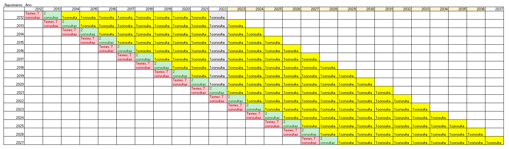
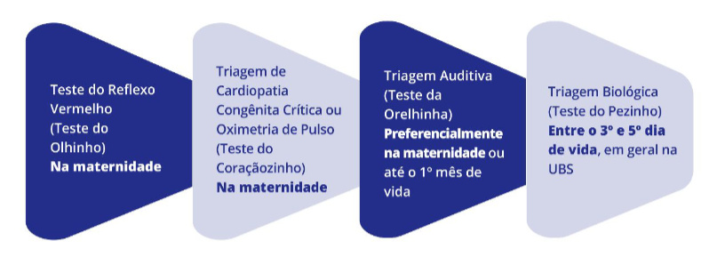
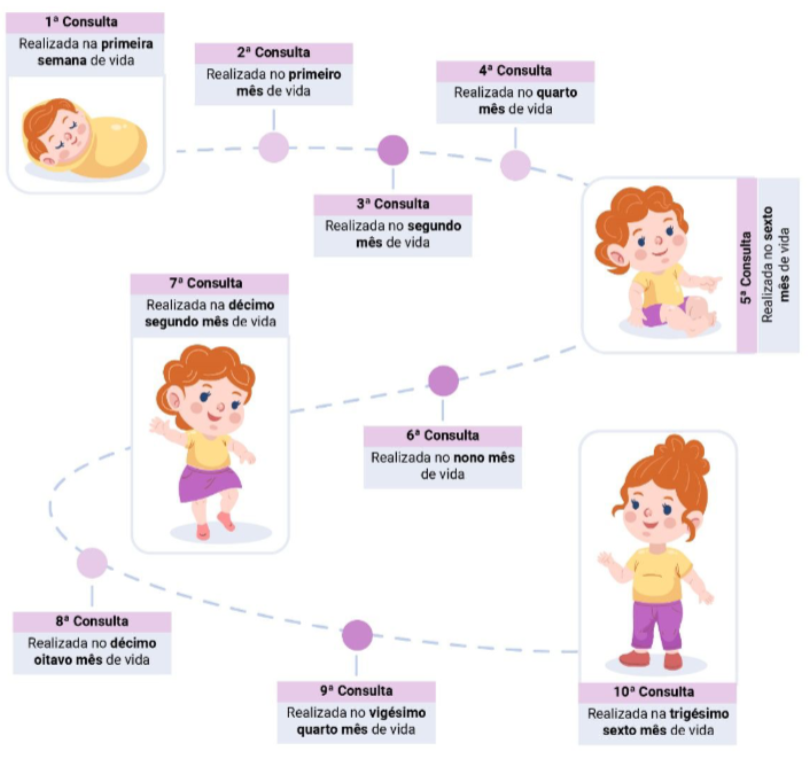
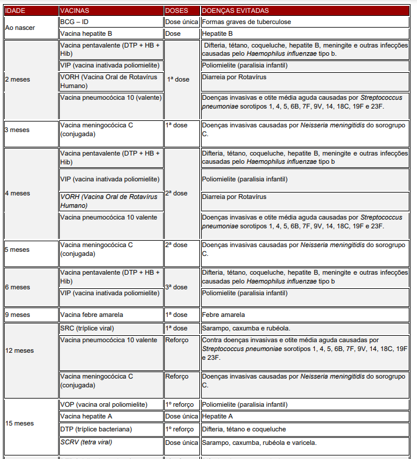
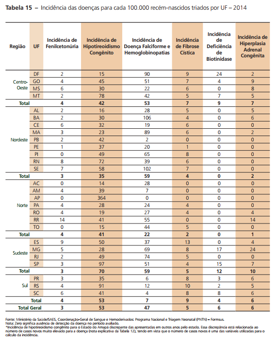
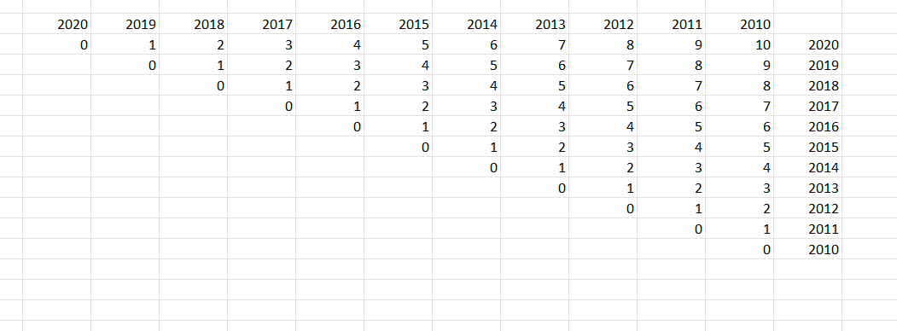

```{r setup, include=FALSE}
knitr::opts_chunk$set(echo = TRUE)
setwd("~/GitHub/saude_rn_crianca")
library(tidyverse); library(RODBC)
options(scipen = 999)

dremio_host <- "200.137.215.27"
dremio_port <- "31010"
dremio_uid <- "daniel"
dremio_pwd <- Sys.getenv("datalake")

channel <- odbcDriverConnect(sprintf("DRIVER=Dremio Connector;HOST=%s;PORT=%s;UID=%s;PWD=%s;AUTHENTICATIONTYPE=Basic Authentication;CONNECTIONTYPE=Direct", dremio_host, dremio_port, dremio_uid, dremio_pwd))

```

## Contextualização 

Essa linha de cuidado integra a rede de atenção materno-infantil e é uma continuação do que foi implementado na linha da gestante. Optou-se por utilizar um modularização, ou seja, a implementação da linha de cuidado das gestantes e, em sequência, a implementação das etapas de assistência ao recém-nascido e crescimento e desenvolvimento infantil.


## Mapeamento de dados sobre saúde do Recém Nascido (RN) e Criança

A primeira informação relevante que precisamos considerar aqui é o número de RN que teremos por região, no país. A consulta abaixo acessa o datalake para computar o número de nascimentos ao longo dos últimos dez anos no país. 

Acessar os últimos dez anos é relevante por permitir que a gente avalie o horizonte temporal completo que inclui os cuidados ao RN e crianças. 

```{r}
hierarquia_municipios <- sqlQuery(channel, 'SELECT * FROM "Analytics Layer".Territorial."Municípios - Hierarquia Completa"')


df1 <- sqlQuery(channel, 'SELECT CODMUNRES, UF, ANO, COUNT(*) AS TOTAL
                            FROM(
                                  SELECT substr(CODMUNRES, 1, 6) AS CODMUNRES,
                                          substr(CODMUNRES, 1, 2) AS UF, 
                                          CAST(substr(DTNASC, 5, 4) AS INT) AS ANO
                                  FROM Dados.sinasc.DN)
                            GROUP BY CODMUNRES, UF, ANO')
```

Sabe-se que, ao nascer, o RN passará por consultas e alguns testes. Passados três anos, ela passará por uma consulta anual para acompanhar o crescimento. 

A figura abaixo ilustra o racional adotado



# Planejamento do serviço 

O planejamento do serviço se dá a partir de algumas orientações, sendo que três dimensões são analisadas: Testes do RN, consultas, imunização

### Teste do RN

Os testes necessários estão na figura abaixo. 



### Consultas

A relação de consultas e período adequado para realização estão descritos na figura 3. 



### Imunizações 

Ao longo dos primeiros anos de vida, algumas vacinas serão necessárias. 



### Doenças

Por fim, foram consultados dados sobre a prevalência de doenças em RN, diagnosticadas por meio dos testes feitos nos primeiros dias de vida. 



# Análise do total por ano de nascimento 

Foram consultados dados do número de nascimentos por região

```{r message=FALSE, warning=FALSE}
hierarquia_regioes <- hierarquia_municipios %>% 
                        select(cod_municipio,regiao_pad, regiao,
                               uf, uf_sigla, macrorregiao, regiao_saude) 

b <- df1 %>% 
    filter(ANO > 2009 & ANO < 2021) %>% 
    left_join(hierarquia_municipios, by = c('CODMUNRES'='cod_municipio')) %>% 
    group_by(regiao, ANO) %>% 
    summarise(cont = sum(TOTAL)) %>% 
    filter(regiao != "NA") %>% 
    ggplot(aes(x = ANO, y = cont, col = regiao)) + geom_line() + 
    theme_minimal() + scale_x_continuous(breaks = seq(2010, 2020, 5)) + facet_wrap(~regiao, scales = "free") + theme(legend.position="none")

plotly::ggplotly(b)


```

Todavia, ao longo desse período tivemos óbitos infantis. Por esse motivo, vamos baixar os dados de óbitos, conforme o código abaixo. 


```{r}
obitos_infantis <- sqlQuery(channel, "SELECT CODMUNRES, ANO_OBITO, ANO_NASC, COUNT(*) AS                                           QTD_OBITO FROM(
                                                  SELECT
                                                      substr(CODMUNRES, 1, 6) as CODMUNRES,
                                                      substr(DTOBITO, 5, 4) as ANO_OBITO,
                                                      substr(DTNASC, 5, 4) as ANO_NASC,
                                                      IDADE
                                                  FROM Dados.sim.DO
                                                  WHERE IDADE < 411
                                              )
                                              GROUP BY CODMUNRES, ANO_OBITO, ANO_NASC")

```

Tendo este dado, vamos deduzir os óbitos infantis que tivemos nesses municípios. Para isso, foi importante desconsiderar alguns registros de acordo com o ano de nascimento. Ex.: Se não houver o tratamento, ao acessar dados de 2015, pegaríamos os óbitos de crianças de 10 anos, por exemplo. No entanto, este caso já não faz parte do horizonte temporal que estamos analisando. 



```{r}

# Pegando a quantidade de obitos acumulado dos nascidos em ano x

obitos_infantis_t <- obitos_infantis %>% 
    filter(ANO_NASC > 2009) %>%
    filter(ANO_OBITO >= ANO_NASC) %>% 
    group_by(CODMUNRES, ANO_NASC) %>% 
    summarise(obitos_ano = sum(QTD_OBITO)) %>% 
    mutate(ANO_NASC = as.integer(ANO_NASC))


nascimentos_cidade <- df1 %>% 
    filter(ANO > 2009 & ANO < 2021) %>%
    #mutate(idade = ano_referencia - ANO) %>% 
    left_join(hierarquia_municipios, by = c('CODMUNRES'='cod_municipio')) %>%
    filter(regiao != "NA") %>% 
    group_by(CODMUNRES,regiao, uf_sigla, municipio, ANO) %>% 
    summarise(cont_nasc = sum(TOTAL)) 


liquido <- obitos_infantis_t %>% 
                left_join(nascimentos_cidade, 
                          by = c("CODMUNRES",
                                 "ANO_NASC" = "ANO"))

liquido$cont_nasc[is.na(liquido$cont_nasc)] <- 0

# retirei os NA aqui, pois, por problemas de registro, a pessoa coloca que o município foi 52000. Todavia, esse código não identifica nenhum município, apenas o estado como um todo, que nesse caso é Goiás. 

liquido <- liquido %>% 
                filter(municipio != "NA") %>% 
                mutate(qtd_liquido = cont_nasc - obitos_ano)
```

Tomando o ano de 2020 como referência, podemos ver quantas crianças nós temos em cada município e por cada ano de nascimento. 

```{r message=FALSE, warning=FALSE}
DT::datatable(liquido)
```

Vamos dar uma olhada na quantidade de crianças que temos no ano de 2020 por idade e por região. 

```{r message=FALSE, warning=FALSE}

ano_referencia <- 2020
    
a <- liquido %>% 
    mutate(idade = ano_referencia - ANO_NASC) %>% 
    group_by(regiao, idade) %>% 
    summarise(cont = sum(qtd_liquido)) %>%     
    ggplot(aes(x = idade, y = cont, fill = regiao)) + geom_col() +
    scale_x_continuous(breaks = seq(1,10,1)) + coord_flip() + 
    facet_wrap(~regiao, scales = "free") + theme_minimal() + theme(legend.position="none")

plotly::ggplotly(a)


```

Além de observar os serviços programáticos para cada recém-nascido e criança, podemos estimar serviços especializados para casos de doenças congênitas. 


# Serviços necessários 

Triagem física = triagem de coração, triagem auditiva e triagem da visão. 

```{r}

servicos_ano_referencia <- 
  liquido %>% 
  mutate(proc_consultas = case_when(ANO_NASC == ano_referencia ~ 7,
                               ANO_NASC == (ano_referencia - 1) ~ 2,
                               ANO_NASC == (ano_referencia - 3) ~ 1,
                               TRUE ~ 1),
         proc_triagem_fisica = if_else(ANO_NASC == ano_referencia, 1, 0),
         proc_triagem_biologica = if_else(ANO_NASC == ano_referencia, 1, 0,),
         proc_vacinas = case_when(ANO_NASC == ano_referencia ~ 8, 
                                       ANO_NASC == (ano_referencia - 1) ~ 1, 
                                       ANO_NASC == (ano_referencia - 4) ~ 1,
                                       ANO_NASC == (ano_referencia - 5) ~ 1,
                                       TRUE ~ 0)) %>% 
  mutate(qtd_consultas = proc_consultas * qtd_liquido, 
         qtd_triagem_fisica = proc_triagem_fisica * qtd_liquido, 
         qtd_vacinas = proc_vacinas * qtd_liquido,
         qtd_triagem_bio = proc_triagem_biologica * qtd_liquido) 


```


```{r}

qtd_servicos <- 
  servicos_ano_referencia %>%   
    group_by(CODMUNRES, uf_sigla, regiao, municipio) %>% 
    summarise(qtd_liquido = sum(qtd_liquido), 
              qtd_consultas = sum(qtd_consultas),
              qtd_triagem_fisica = sum(qtd_triagem_fisica),
              qtd_vacinas = sum(qtd_vacinas),
              qtd_triagem_bio = sum(qtd_triagem_bio))

qtd_servicos %>% 
  ungroup() %>% 
  select(-CODMUNRES) %>% 
  DT::datatable()

```


# Produtividade 

O tempo de procedimentos é variável. Vamos assumir uma média de valores do tempo. Porém, uma vez implementado, o sistema poderá ser parametrizado. 


```{r}

tempo_servicos <- 
  qtd_servicos %>% 
    mutate(tempo_consultas = 0.5 * qtd_consultas,
           tempo_triagem_fisica = 0.66 * qtd_triagem_fisica,
           tempo_vacinas = 0.25 * qtd_vacinas, 
           tempo_triagem_bio = 0.25 * qtd_triagem_bio)

```


# FTE 

Total de força de trabalho de equivalente. Para isso, adotou-se como referência um profissional que atua com 40h semanais, ou seja, 160h mensais. Considerando um ano de 10 meses anos e meio, devido a férias e eventuais ausências, tem-se um valor de 1680h de profissional por ano.   

```{r}
fte <- 
  tempo_servicos %>% 
  mutate(fte_consultas = round(tempo_consultas/1680, 2), 
         fte_triagem_fisica = round(tempo_triagem_fisica/1680, 2),
         fte_triagem_bio = round(tempo_triagem_bio/1680, 2),
         fte_vacinas = round(tempo_vacinas/1680, 2),
         fte_total = sum(fte_consultas, fte_triagem_bio, fte_triagem_fisica, fte_vacinas),
         fte_mensal = round(fte_total/12), 2)

DT::datatable(fte)
```

# Possíveis avanços 

+ Incorporação de serviços relacionados à triagem neonatal 
