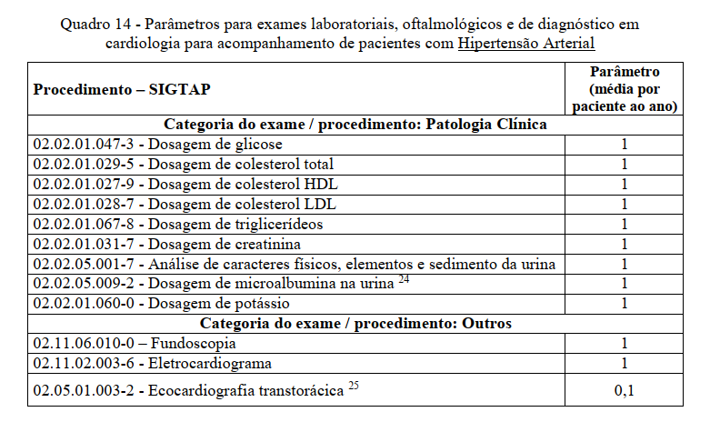
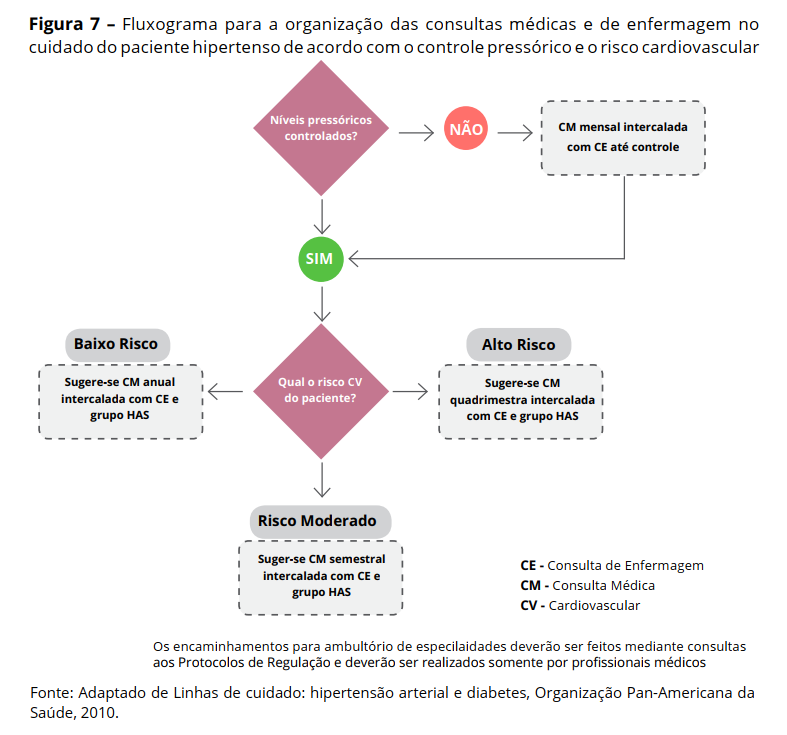

```{r setup, include=FALSE}
knitr::opts_chunk$set(echo = TRUE)

library(tidyverse)
library(readxl)
library(geobr)
library(leaflet)
options(scipen = 999)

if (!require(RODBC)) { install.packages(RODBC); require(RODBC) }

dremio_host <- "200.137.215.27"
dremio_port <- "31010"
dremio_uid <- "daniel"
dremio_pwd <- Sys.getenv("datalake")

channel <- odbcDriverConnect(sprintf("DRIVER=Dremio Connector;HOST=%s;PORT=%s;UID=%s;PWD=%s;AUTHENTICATIONTYPE=Basic Authentication;CONNECTIONTYPE=Direct", dremio_host, dremio_port, dremio_uid, dremio_pwd))

setwd("~/GitHub/dimensionamento/04_HAS/hipertensao")

```

# População 

Vamos acessar a população por faixa etária e tratar de modo que fique agrupada de forma semelhante à PNS. 

```{r}

pop_uf <- sqlQuery(channel,
                   'SELECT * FROM "Analytics Layer".Territorial."População SVS por UF e faixa etária PNS"')


pop_mun <- sqlQuery(channel, 
                    'SELECT * FROM "Analytics Layer".Territorial."População SVS por município e faixa etária PNS"')

```


# Epidemiologia 

Os dados de epidemiologia são oriundos da Pesquisa Nacional de Saúde (2019). Vamos acessar apenas a variável que informa a prevalência de hipertensão por faixa etária e a nível UF. 

```{r}

pns <- sqlQuery(channel, 'SELECT * FROM Dados.pesquisa_nacional_saude."questoes_doencas_cardiovasculares.parquet"')


pns_has <- 
  pns %>% 
  filter(questao_pns == 4419) %>% 
  filter(uf != "Brasil")  
  
pns_has$faixa_etaria <- trimws(pns_has$faixa_etaria)

```


Precisamos concatenar as informações sobre prevalência das faixas etárias e população. Para esse exemplo, vamos acessar apenas dados de 2021 da população. 

```{r}
pop21 <- 
  pop_uf %>% 
  filter(ANO == 2021) %>% 
  filter(FAIXA_ETARIA != "Menor de 18 anos")

pop_has <- 
  pop21 %>% 
  left_join(pns_has, by = c("UF" = "codigo_uf",
                            "FAIXA_ETARIA" = "faixa_etaria")) %>% 
  mutate(percentual = percentual/100) %>% 
  mutate(pop_has = POPULACAO * percentual) %>% 
  rename(UF_nome = uf) %>% 
  select(UF, UF_nome, POPULACAO, FAIXA_ETARIA, percentual, pop_has) %>% 
  janitor::clean_names()

DT::datatable(pop_has)

```


### Percentual por faixa etária

```{r}
gerar_grafico <- function(faixa) {
  pop_has %>% 
  filter(faixa_etaria == faixa) %>% 
  ggplot(aes(x = forcats::fct_reorder(uf_nome, percentual), y = percentual)) + geom_col() + coord_flip() + 
  theme_minimal() + xlab("UF") + ylab("População com HAS")
}
```


### Faixa etária de 18 a 29 anos

```{r}

a <- gerar_grafico(faixa = "18 a 29 anos")

plotly::ggplotly(a)

```

### Faixa etária de 30 a 59 anos 

```{r}

b <- gerar_grafico(faixa = "30 a 59 anos")

plotly::ggplotly(b)

```

### Faixa etária de 60 a 64 anos 

```{r}

c <- gerar_grafico(faixa = "60 a 64 anos")

plotly::ggplotly(c)

```

### Faixa etária de 65 a 74 anos 

```{r}

d <- gerar_grafico(faixa = "65 a 74 anos")

plotly::ggplotly(d)

```

### Faixa etária de 75 anos ou mais 

```{r}

e <- gerar_grafico(faixa = "75 anos ou mais")

plotly::ggplotly(e)

```

As pessoas que possuem diagnóstico de hipertensão são estratificadas em graus de risco alto, médio ou baixo. De acordo com o caderno de critérios e parâmetros, 40% das pessoas hipertensas são do estrato baixo, 35% do estrato médio e 25% do estrato alto. Essa distribuição irá influenciar na quantidade de serviços prestados a essa população. 

```{r}

pop_has <- 
  pop_has %>% 
  mutate(has_alto = pop_has * 0.25,
         has_medio = pop_has * 0.35,
         has_baixo = pop_has * 0.40) 

```

# Serviços 

## Atenção secundária
Todas as pessoas realizarão alguns exames anualmente



Além dos exames, os pacientes com hipertensão precisarão de um monitoramento constante na atenção primária com consultas sendo realizadas com diferentes frequências, conforme o material sobre a linha de cuidado de Hipertensão Arterial Sistêmica




```{r}

pop_has <- 
  pop_has %>% 
  mutate(proc_glicose = pop_has,
         proc_colesterol = pop_has, 
         proc_colesterol_hdl = pop_has, 
         proc_triglicerideos = pop_has, 
         proc_creatinina = pop_has, 
         proc_urina = pop_has, 
         proc_microalbumina_urina = pop_has,
         proc_potassio = pop_has, 
         proc_fundoscopia = pop_has, 
         proc_eletrocardiograma = pop_has, 
         proc_ecocardiografia = pop_has * 0.1,
         proc_cons_enf = has_baixo * 0.5 + has_medio * 1 + has_alto * 2,
         proc_cons_med = has_baixo * 0.5 + has_medio * 1 + has_alto * 2)

```

# Limitação 

A presente análise se refere apenas ao acompanhamento da população com hipertensão arterial controlada. Para avançar mais a metodologia, é necessário incluir dados sobre: 

+ população que recebeu o diagnóstico, mas sem sem controle de pressão, visto que, de acordo com orientações do MS, pessoas que se encontram nessa condição precisam de um acompanhamento mensal até o controle; 

+ ações para o diagnóstico de pressão arterial: aquelas pessoas que acessaram os pontos focais do serviços de saúde e tiveram suspeita de hipertensão devem passar por alguns procedimentos, como a mensuração da Pressão Arterial em um intervalo de 7 a 14 dias, assim como outros exames.   


