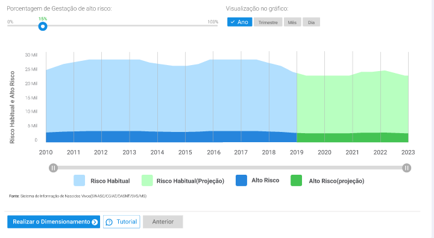
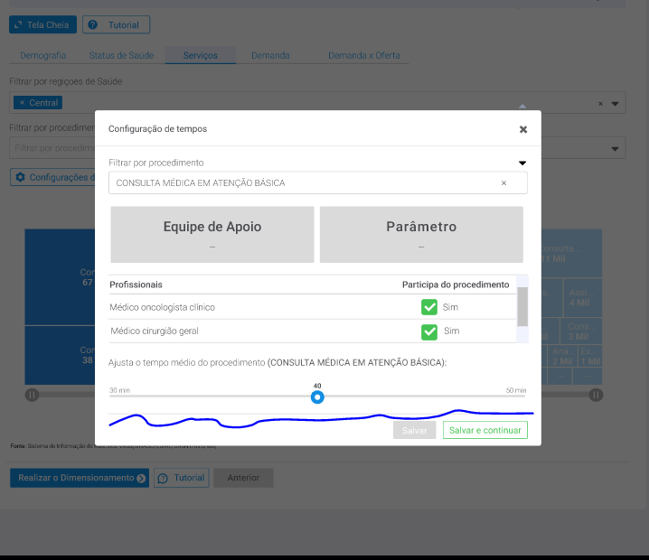
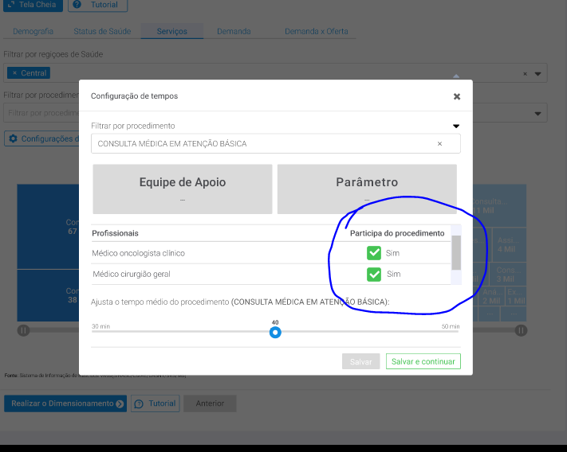

```{r setup, include=FALSE}
knitr::opts_chunk$set(echo = TRUE, warning = FALSE)
```

```{r echo=TRUE, message=FALSE, warning=FALSE}
library(tidyverse)
library(readxl)
library(RODBC)
```


## Estudo de demanda - gestante

Suponha que a gente tenha 100 nascimentos em um ano. Deste 100, 15 serão de alto risco e 85 serão de risco habital. Por padrão o percentual de alto risco é 15%. Porém, isso pode ser alterado pelo usuário já. 

Cada gestante deverá passar por uma lista de procedimentos. 

```{r}

tempos_procedimentos <- read_excel("~/GitHub/dimensionamento/05_Gestantes/script/análise de procedimentos/tempos_procedimentos.xlsx")


```

Existem procedimentos que devem ser realizado para **todas as gestantes** e existem procedimentos que podem ser realizados apenas para gestantes de alto risco. Ou seja, mesmo se ela for alto risco, ela também passará pelos procedimentos da gestante de risco habitual também. 

# Calculando frequência por tipo

Primeiro vamos pegar os procedimentos, independente de quem realiza para vermos o volume necessário, independente das categorias que podem executá-lo. Observa-se que existem 38 procedimentos, sendo que 13 são exclusivos para a gestante de alto risco e 35 são exclusivos para a gestante de risco habitual. 

```{r}

procedimentos <- 
  tempos_procedimentos %>% 
  select(procedimento, tipo_gestante, nivel_atencao,
         cod_sigtap, parametro, tempo_medio) %>% 
  distinct(procedimento, cod_sigtap, .keep_all = TRUE)

procedimentos

```

Existe um tratamento necessário em relação ao tipo de parto: normal ou cesárea. O segundo traz mais implicações em termos de força de trabalho necessária. 

Essa consulta mostra o percentual de partos normais e cesáreas em uma região

```{r}

consulta <- 'SELECT * FROM "Analytics Layer"."Epidemiológico".Nascimentos."Nascimentos por tipo e região de saúde"'

dremio_host <- "200.137.215.27"
dremio_port <- "31010"
dremio_uid <- "daniel"
dremio_pwd <- Sys.getenv("datalake")

channel <- odbcDriverConnect(sprintf("DRIVER=Dremio Connector;HOST=%s;PORT=%s;UID=%s;PWD=%s;AUTHENTICATIONTYPE=Basic Authentication;CONNECTIONTYPE=Direct", dremio_host, dremio_port, dremio_uid, dremio_pwd))

prop_regiao <-
  sqlQuery(channel, consulta)

```

Vamos pegar os dados do ano de 2021 da região de saúde Oeste II de Goiás. Nessa região e ano indicado, tivemos 83% de nascimentos decorrente de cesárea

```{r}

prop_regiao <- 
  prop_regiao %>% 
    filter(cod_regsaud == '52010' & ano == 2021)

prop_regiao

```

Vamos ajustar essa proporção nos parâmetros de parto. 

```{r}

procedimentos <- 
  procedimentos %>% 
    mutate(parametro = case_when(cod_sigtap == "0411010034" ~ parametro * 0.83,
                               cod_sigtap == "0310010039" ~ parametro * 0.17,
                               TRUE ~ parametro))

```

Vamos calcular o total de procedimentos por tipo de gestante. O parâmetro foi baseado em um conjunto de documentos institucionais. **Não tínhamos o requisito de o usuário modificar esse parâmetro. Se houver um impacto baixo ou médio, seria interessante adicionar, casoa equipe do MS ache interessante.** 


```{r}

total_gestantes <- 100

percentual_default_alto <- 0.15

alto_risco <- total_gestantes * percentual_default_alto

procedimentos_freq <- 
  procedimentos %>% 
  mutate(frequencia = case_when(tipo_gestante == "Todas as Gestantes" ~ parametro * total_gestantes,
                                                  TRUE ~ parametro * alto_risco))

procedimentos_freq

```

Vamos calcular o total de tempo necessário por procedimentos. **Lembrando que tempo é um default que o usuário poderá ajustar**. 

```{r}

procedimentos_tempo <- 
  procedimentos_freq %>% 
  mutate(tempo_total = tempo_medio * frequencia)

procedimentos_tempo

```

Agora temos que calcular a quantidade de profissionais necessária. Sabemos que um procedimento pode ser realizado por vários profissionais. Vamos dar uma conferida quais os procedimentos temos que mais de um profissional pode atuar. 

```{r}

profissionais_aptos <- 
  tempos_procedimentos %>% 
  select(procedimento, cod_sigtap, codigo_familia_cbo, categoria_profissional) %>% 
  distinct(procedimento, cod_sigtap, codigo_familia_cbo, categoria_profissional)

profissionais_aptos

```


Outro requisito que foi **estabelecido no passado era poder excluir algum profissional dessa lista**. 

Vamos fazer uma consulta para entender quantos profissionais podem realizar cada procedimento. Isso auxiliará em determinada etapa.  

```{r}

numero_prof_aptos <- 
  profissionais_aptos %>% 
  group_by(procedimento, cod_sigtap) %>% 
  count() %>% 
  rename(numero_prof_aptos = n)

numero_prof_aptos

```

Vamos juntar os profissionais a tabela dos tempos de procedimentos e profissionais aptos. A coluna `tempos_prof` serve justamente para saber quanto tempo vamos indicar para cada categoria profissional que pode realizar o procedimento. Nesse caso, temos um cenário equitativo, ou seja, se temos 10 profissionais que podem realizar o procedimento, teremos a distribuição de tempo para 1/10 de cada profissional.

```{r}

procedimento_profissionais <- 
  procedimentos_tempo %>% 
    select(-procedimento) %>% 
    inner_join(numero_prof_aptos, by = "cod_sigtap") %>% 
    mutate(tempo_prof = tempo_total/numero_prof_aptos)

procedimento_profissionais

```

Agora vamos juntar a tabela de profissionais com a do tempo para cada profissional. Como temos um cenário equitativo, só precisamos fazer uma união para coluna do `código SIGTAP de procedimento`. Caso uma categoria fosse priorizada em relação a outra, teríamos que juntar usando duas variáveis, procedimento e identificação do família de CBO.  


```{r}

demanda_prof <- 
  profissionais_aptos %>% 
  left_join(procedimento_profissionais, by = "cod_sigtap") %>% 
  group_by(codigo_familia_cbo, categoria_profissional, nivel_atencao) %>% 
  summarise(tempo = sum(tempo_prof)) %>% 
  mutate(profissionais = tempo/(132 * 12))

demanda_prof

```

Lembrando que estamos falando de um município que tenha 100 nascimentos em um ano. Portanto, a divisão que fizemos acima foi em relação ao tempo para atender esses 100 nascimentos. Portanto, tivemos que dividir o tempo por 132 horas (força de trabalho integral de um profissional, deduzido falta, férias, e outras ausências) e 12 meses. 

```{r}
a <- demanda_prof %>% 
  ggplot(aes(x = fct_reorder(categoria_profissional, profissionais), 
             y = profissionais, fill = nivel_atencao)) + geom_col() + 
  coord_flip() + xlab("Profissionais") + ylab("Total de profissionais em tempo integral") +
  theme_minimal()

plotly::ggplotly(a)

```

## Calculando profissionais de apoio

Até o momento tivemos um cálculo para as categorias profissionais que executam o procedimento finalístico. No entanto, também temos que incluir a equipe de apoio. Portanto, o próximo passo vai ser analisar o apoio do profissional de apoio. Seguiremos um caminho semelhante ao que já para os profissionais finalísticos. 

Primeiro, vamos filtrar aqueles procedimentos que possuem profissional de apoio. Além disso, vamos calcular o tempo exigido, considerando a frequência e o total de procedimentos.  

```{r}

tempos_procedimentos$Tempo_atuacao_apoio <- as.numeric(tempos_procedimentos$Tempo_atuacao_apoio)


proc_apoio <- tempos_procedimentos %>% 
                  filter(profissional_apoio == "sim") %>% 
                  select(procedimento, tipo_gestante, nivel_atencao,
                         cod_sigtap, parametro, Tempo_atuacao_apoio) %>% 
                  distinct(procedimento, cod_sigtap, .keep_all = TRUE) %>% 
                  mutate(parametro = case_when(cod_sigtap == "0411010034" ~ parametro * 0.83,
                                        cod_sigtap == "0310010039" ~ parametro * 0.17,
                                        TRUE ~ parametro)) %>% 
                  mutate(frequencia = case_when(
                                        tipo_gestante == "Todas as Gestantes" ~ parametro * total_gestantes,
                                        TRUE ~ parametro * alto_risco)) %>% 
                  mutate(tempo_total = Tempo_atuacao_apoio * frequencia)

proc_apoio

```

```{r}
profissionais_aptos_apoio <- 
  tempos_procedimentos %>% 
  filter(profissional_apoio == "sim") %>% 
  select(procedimento, cod_sigtap, familia_cbo_apoio, descricao_cbo_profissional_apoio) %>% 
  distinct(procedimento, cod_sigtap, familia_cbo_apoio, descricao_cbo_profissional_apoio)

profissionais_aptos_apoio
```

```{r}
numero_prof_aptos_apoio <- 
  profissionais_aptos_apoio %>% 
  group_by(procedimento, cod_sigtap) %>% 
  count() %>% 
  rename(numero_prof_aptos = n)

numero_prof_aptos_apoio
```


```{r}
procedimento_profissionais_apoio <- 
  proc_apoio %>% 
    select(-procedimento) %>% 
    inner_join(numero_prof_aptos, by = "cod_sigtap") %>% 
    mutate(tempo_prof = tempo_total/numero_prof_aptos)

procedimento_profissionais_apoio
```

Calculando a demanda por profissionais de apoio 

```{r}
demanda_prof_apoio <- 
  profissionais_aptos_apoio %>% 
  left_join(procedimento_profissionais_apoio, by = "cod_sigtap") %>% 
  group_by(familia_cbo_apoio, descricao_cbo_profissional_apoio, nivel_atencao) %>% 
  summarise(tempo = sum(tempo_prof)) %>% 
  mutate(profissionais = tempo/(132 * 12))

demanda_prof_apoio
```

## Juntando profissionais finalístico e apoio temos

```{r}
demanda_prof_apoio <- demanda_prof_apoio %>% 
                              rename(codigo_familia_cbo = familia_cbo_apoio,
                              categoria_profissional = descricao_cbo_profissional_apoio)

demanda_prof$codigo_familia_cbo <- as.character(demanda_prof$codigo_familia_cbo)

demanda <- rbind(demanda_prof, demanda_prof_apoio)

demanda <- demanda %>% 
                group_by(codigo_familia_cbo, categoria_profissional, nivel_atencao) %>% 
                summarise(tempo = sum(tempo),
                          profissionais = sum(profissionais))

```

O gráfico contém tanto os profissionais de apoio quanto os finalísticos

```{r}

b <- demanda %>% 
  ggplot(aes(x = fct_reorder(categoria_profissional, profissionais), 
             y = profissionais, fill = nivel_atencao)) + geom_col() + 
  coord_flip() + xlab("Profissionais") + ylab("Total de profissionais em tempo integral") +
  theme_minimal()

plotly::ggplotly(b)

```


# Síntese de alguns requisitos que temos que assegurar que tenhamos

Aqui tem um lista de requisitos que foram listados anteriormente ou que surgiram ao longo da evolução da metodologia que temos que assegurar que tenha. Essa lista vai além do escopo dos cálculos aqui presentes. 

O link do protótipo pode ser acessado [aqui](https://www.figma.com/proto/FJFUtJoWYISWALJQ2gsj76/SisDim-Prot%C3%B3tipos?node-id=1042%3A2393&scaling=min-zoom&page-id=1016%3A2897&starting-point-node-id=1016%3A2898&show-proto-sidebar=1)

A lista está em ordem de prioridade. 

1) Temos que ter na segunda tela (status de saúde) um gráfico que delimite o que é projeção e o que é valor real



2) No modal de ajuste de tempo de procedimento, temos que ter a descrição do procedimento, o tempo default do profissional finalístico e o tempo default do profissional de apoio. Os dois últimos podem ser ajustados pelo usuário. Creio que hoje só temos o default do profissional finalístico



3) Abaixo da tela que tem o número de nascidos, seria interessante adicionar um gráfico de pizza que mostre o percentual de partos cesáreos e o percentual de partos naturais, resultado da consulta acima.


4) Excluir profissional que pode realizar determinado procedimento 



5) Simulação de cenários: semelhante ao que foi feito na metodologia de especialidades médicas. Podemos ter uma simulação do resultado ao final, considerando um aumento em 10% do tempo dos procedimentos, por exemplo
