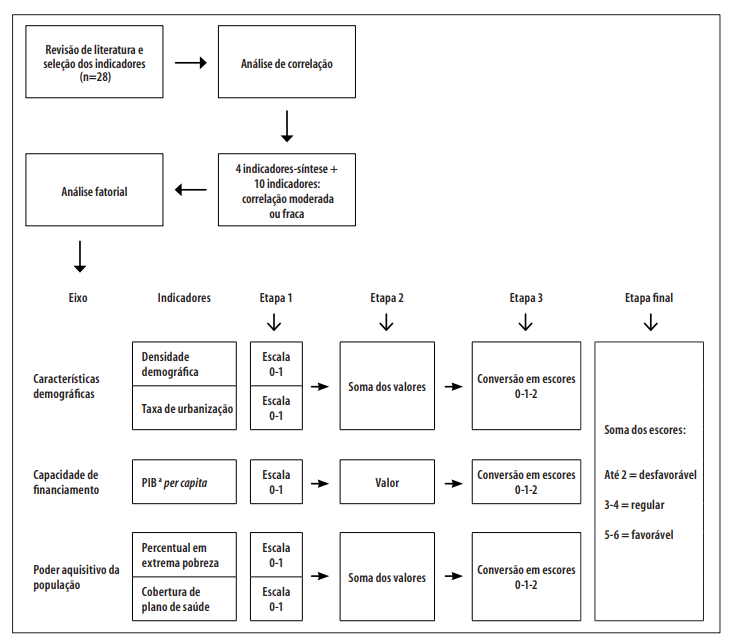
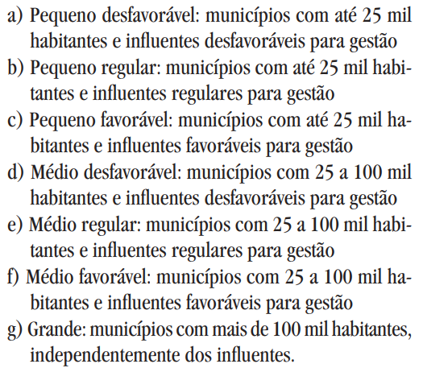
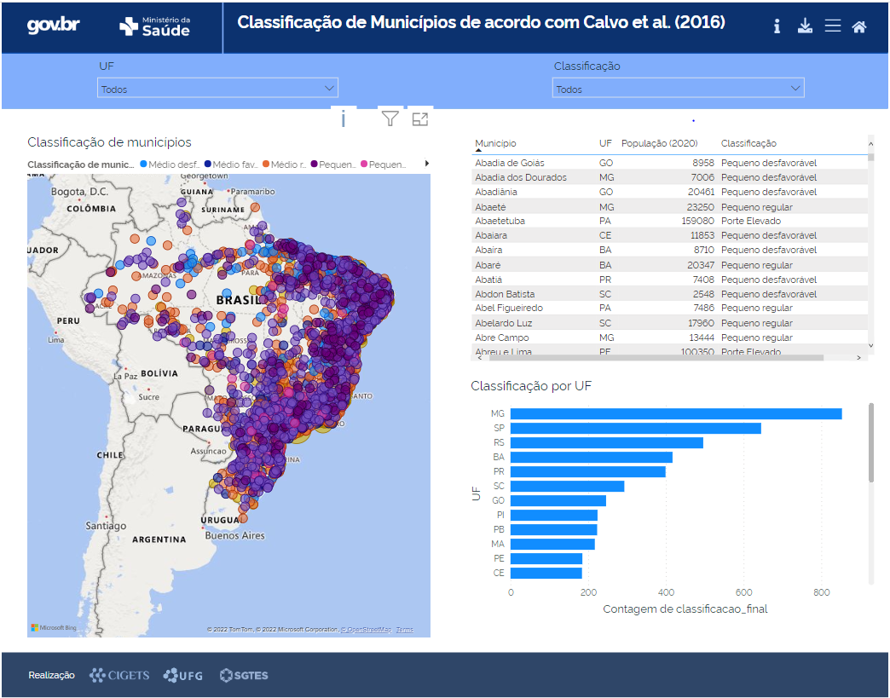

```{r setup, include=FALSE}
knitr::opts_chunk$set(echo = TRUE)
options(scipen = 999)
pacman::p_load("tidyverse", "readxl","scales")
```

## 1. Contextualização

A presente análise tem como objetivo reproduzir o método desenvolvido por Calvo et al. (2016) a fim de classificar municípios brasileiros em termos de vulnerabilidade. 

As variáveis extraídas pelos pesquisadores foram: 

1) Densidade demográfica 
2) Taxa de Urbanização 
3) PIB per capita 
4) Percentual em extrema pobreza 
5) Cobertura de plano de saúde 

De acordo com os autores, os itens 1 e 2 se referem a uma dimensão de características demográficas. O item 3 se refere à capacidade de financiamento. Os itens 5 e 6 se referem ao poder aquisitivo da população. 

## 2. Método de Calvo et al. (2016)

O método de Calvo et al. (2016) é sintetizado na figura 1



1) Os autores identificaram 28 indicadores a partir de uma revisão da literatura;
2) Após uma análise de correlação, foram mantidos os 14 com maior grau de correlação (acima de 0.70);
3) Em sequência, foi realizada uma análise fatorial que sugeriu a extração de três fatores, formados por cinco variáveis, apresentadas na seção 1;
4) Essas cinco variáveis foram normalizadas (procedimento para manter valores em uma escala de 0 a 1);
5) Após a normalização, foram feitas somas para classificar os municípios em desfavorável, regular e desfavorável;
6) Um último procedimento envolveu o cruzamento entre o escore de classificação do município e o seu tamanho;

## 3. Reproduzindo o método

A seguir serão reproduzidas as análises de Calvo et al. (2016). 

### 3.1. Fonte dos dados 
A fim de reproduzir as análises de Calvo et al. (2016), com exceção de dados de plano de saúde, retirados da Agência Nacional de Saúde Suplementar (ANS), os demais foram coletados a partir do IBGE, seja do último censo ou projeções populacionais.  

Cabe mencionar que as variáveis foram acessadas para os últimos anos disponíveis. Algumas delas originaram do censo de 2010, por exemplo. Enquanto outras foram mais recentes, como os dados da ANS (2020) e PIB per capita do IBGE (2019). 

No ano de 2010, o Brasil contava com 5565 municípios. Por isso, não é possível calcular o indicador para aqueles que foram criados em anos posteriores. 

### 3.2. Procedimentos metodológicos 

Vamos fazer a leitura dos dados

```{r}

indicadores_porte <- read_excel("indicadores_porte.xlsx")

```

Agora vamos normalizar as variáveis de modo que se mantenham em um intervalo de 0 a 1. 

```{r}

indicadores_normalizados <- 
              indicadores_porte %>% 
                mutate(rs_densid_dem = rescale(Densidade_demografica_2020),
                       rs_domic_urb = rescale(percentual_domicilios_urbanos_2010),
                       rs_pib_pc = rescale(PIB_percapita_2019),
                       rs_extrema_pob = rescale(`percentual_população_com_renda_<_1/4_SM2010`),
                       rs_plano_saude = rescale(Cobertura_plano_saude_Dez2020)) %>% 
                select(cod_mun, UF, Nom_mun, População_residente_2020, 
                       starts_with("rs"))

```

Semelhante ao que foi realizado por Calvo et al. (2016), são somados os valores das variáveis de mesmo fator. 

```{r}
indicadores_normalizados <- 
              indicadores_normalizados %>% 
                mutate(caract_demograficas = rs_densid_dem + rs_domic_urb,
                       capac_financiamento = rs_pib_pc,
                       poder_aquisitivo = rs_extrema_pob + rs_plano_saude) %>% 
              filter(rs_domic_urb != "NA") # exclusão de casos omissos de municípios inexistentes em 2010

```

Agora é necessário transformar cada um dos fatores em escores de 0 a 2. Essa transformação se dá a partir de uma análise de medidas de posição. Valores abaixo do primeiro quartil recebem a nota 0, valores acima do terceiro quartil recebem a nota 2 e, finalmente, os demais recebem a nota 1. 

Em sequência, é feito um somatório dos escores 


```{r}
escores <- indicadores_normalizados %>% 
  mutate(escore_demog = case_when(
                            caract_demograficas <= quantile(caract_demograficas, 0.25) ~ 0,
                            caract_demograficas > quantile(caract_demograficas, 0.25) &
                            caract_demograficas <= quantile(caract_demograficas, 0.75) ~ 1,
                            caract_demograficas > quantile(caract_demograficas, 0.75) ~ 2)) %>%
  mutate(escore_cap = case_when(
                            capac_financiamento <= quantile(capac_financiamento, 0.25) ~ 0,
                            capac_financiamento > quantile(capac_financiamento, 0.25) &
                            capac_financiamento <= quantile(capac_financiamento, 0.75) ~ 1,
                            capac_financiamento > quantile(capac_financiamento, 0.75) ~ 2)) %>%
  mutate(escore_pod = case_when(
                            poder_aquisitivo <= quantile(poder_aquisitivo, 0.25) ~ 0,
                            poder_aquisitivo > quantile(poder_aquisitivo, 0.25) &
                            poder_aquisitivo <= quantile(poder_aquisitivo, 0.75) ~ 1,
                            poder_aquisitivo > quantile(poder_aquisitivo, 0.75) ~ 2)) %>% 
  mutate(soma_escores = escore_demog + escore_cap + escore_pod)
  


```

O resultado final desta etapa pode ser resumida no tabela abaixo. 

```{r}

escores <- 
  escores %>% 
    select(cod_mun, UF, Nom_mun, População_residente_2020, 
           escore_demog, escore_cap, escore_pod, soma_escores) %>% 
    mutate(classificacao = case_when(soma_escores <= 2 ~ "Desfavorável",
                                     soma_escores > 2 & soma_escores <= 4 ~ "Regular",
                                     soma_escores > 4 ~ "Favorável"))

DT::datatable(escores)

```
Finalmente, é realizada uma última etapa que envolve o cruzamento da classificação e do porte do município, conforme orientação abaixo. 



```{r}

escores_total <- 
    escores %>% 
      mutate(classificacao_final = case_when(População_residente_2020 <= 25000 & 
                                               classificacao == "Desfavorável" ~ "Pequeno desfavorável",
                                             População_residente_2020 <= 25000 & 
                                               classificacao == "Regular" ~ "Pequeno regular",
                                             População_residente_2020 <= 25000 & 
                                               classificacao == "Favorável" ~ "Pequeno favorável",
                                             População_residente_2020 > 25000 & 
                                             População_residente_2020 <= 100000 &
                                              classificacao == "Desfavorável" ~ "Médio desfavorável", 
                                             População_residente_2020 > 25000 & 
                                             População_residente_2020 <= 100000 &
                                              classificacao == "Regular" ~ "Médio regular",
                                             População_residente_2020 > 25000 & 
                                             População_residente_2020 <= 100000 &
                                              classificacao == "Favorável" ~ "Médio favorável",
                                             População_residente_2020 > 100000 ~ "Porte Elevado"))
  

```


No intuito de gerar uma melhor visualização, foi criado um dashboard no Power BI que pode ser acessado [clicando aqui](https://app.powerbi.com/view?r=eyJrIjoiYjFjYzc5ZTUtODJiZS00NTNkLWEzMGEtMzgwY2ViMDZiZmI1IiwidCI6IjM2Nzg0MTQ4LWIwZWYtNGJjZi1iZDAxLWYyNzJmNzY1MzEzYyJ9). 




## 4. Limitações 

A primeira limitação é o uso de indicadores que podem estar desatualizados, tendo em vista que a fonte foi o censo de 2010. A atualização do próximo censo poderá atualizar esses valores. 

Uma segunda limitação se refere ao uso de apenas cinco dos indicadores extraídos por Calvo et al. (2016). Seria prudente reproduzir todo o fluxo dos pesquisadores a fim de comprovar que a estrutura fatorial se permanece com dados atualizados. 

A terceira limitação diz respeito à técnica utilizada por Calvo et al. (2016). Seria interessante avaliar os resultados a partir de uma análise de componentes principais. Apesar desta possuir objetivo semelhante à análise fatorial, ambas se distinguem em termos de procedimentos matemáticos e estatísticos. A análise de componentes principais tem caráter formativo, enquanto a análise fatorial possui caráter reflexivo. A análise fatorial, portanto, é mais indicada para a mensuração de constructos latentes (ex.: fenômenos psicossociais, como depressão). Para mais informações, acessar os materiais de [Damásio (2012)](https://dialnet.unirioja.es/descarga/articulo/6674931.pdf), também abordado no seguinte [vídeo](https://www.youtube.com/watch?v=bfuWasURBM4) de autoria do mesmo autor. 

Pesquisas futuras podem ser realizadas com o apoio de outras técnicas, como a análise de componentes principais, assim como técnicas de agrupamento para identificar os municípios com classificação semelhante. 


