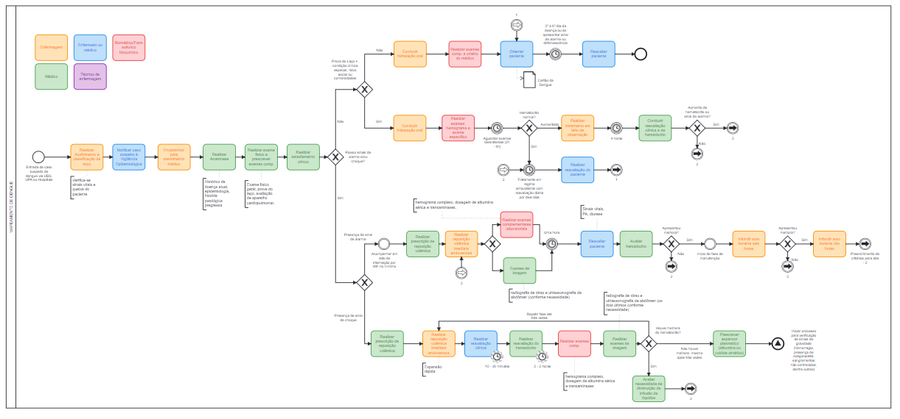

```{r setup, include=FALSE}
knitr::opts_chunk$set(echo = TRUE)
setwd("~/GitHub/dimensionamento/07_dengue")
library(tidyverse); library(RODBC)
options(scipen = 999)

dremio_host <- "200.137.215.27"
dremio_port <- "31010"
dremio_uid <- "daniel"
dremio_pwd <- Sys.getenv("datalake")

channel <- odbcDriverConnect(sprintf("DRIVER=Dremio Connector;HOST=%s;PORT=%s;UID=%s;PWD=%s;AUTHENTICATIONTYPE=Basic Authentication;CONNECTIONTYPE=Direct", dremio_host, dremio_port, dremio_uid, dremio_pwd))

```

### O presente documento é um artefato intermediário da metodologia que apresenta os cálculos empregados e se encontra **em desenvolvimento**.

# 1) Contextualização

A dengue é uma doença negligenciada, sendo a arbovirose mais prevalente em todo o mundo, atingindo mais de 100 países tropicais e subtropicais. No Brasil, os primeiros casos foram descritos em 1685, na cidade de Recife (UNO & ROSS, 2018). Anos depois, o vírus se espalhou por outros estados como São Paulo e Rio de Janeiro, ocasionando as primeiras epidemias no país. Atualmente, a dengue está presente em todo o território nacional (SALLES, 2018).

A dengue é uma patologia sistêmica, de caráter infeccioso, agudo e febril, transmitida aos humanos pelas fêmeas infectadas dos Aedes aegypti e Aedes albopictus (GABRIEL et al., 2018). No Brasil, o principal vetor da doença é o Aedes aegypti, que pertende à família Culicidae, gênero Aedes e subgênero Stegomyia. Esses mosquitos têm preferência por áreas tropicais, quentes e úmidas, o que também caracteriza a dengue como uma doença sazonal (WILDER-SMITH, 2019).

O vírus da dengue (DENV) pertence à família Flaviviridae e ao gênero Flavivirus. Dentre os sorotipos já identificados, o mais prevalente no Brasil é o DENV-2. Cada sorotipo causa diferentes manifestações com intensidades variáveis em seus portadores. Assim, os casos de dengue podem ir desde aqueles assintomáticos, sintomas leves (como dores de cabeça, perda de apetite e erupções cutâneas), até casos graves como febre hemorrágica e síndrome do choque da dengue (RIBEIRO et al., 2021).

Nos primeiros cinco meses do ano de 2020 o número de casos de dengue registrados ultrapassou mais de 1,6 milhão nas Américas, com destaque para o Brasil que registrou 65% desses casos (OPAS, 2020). No país, até a semana epidemiológica 24 de 2022, ocorreram 1.172.882 casos prováveis de dengue (taxa de incidência de 549,8 casos por 100 mil hab.). Embora tais valores representem uma redução de 9,8% de casos registrados em comparação ao mesmo período de 2019, no decorrer do ano de 2022 foi registrado um aumento 195,9% casos até a respectiva semana (BRASIL, 2022).

Tendo em vista a dimensão da dengue como um problema de saúde pública, são necessários estudos que consolidem a linha de cuidados para tal patologia, incluindo o dimensionamento da força de trabalho necessária à sua implementação. Por meio desses estudos é possível intensificar medidas de vigilância, prevenção e controle nas áreas de risco, afetadas e/ou próximas a locais com transmissão recente no Brasil.

Neste sentido, o presente documento é um relato técnico que possui como objetivo descrever o desenvolvimento da metodologia de necessidades para a linha de cuidado da dengue. A figura 1 ilustra o racional utilizado e tem como principias referências estudos de pesquisadores como [Tomblin Murphy et al. (2016)](https://www.ncbi.nlm.nih.gov/pmc/articles/PMC5595212/), [Mackenzie et al. (2022)](https://journals.sagepub.com/doi/full/10.1177/08404704221093982?casa_token=P5803jHTk0gAAAAA:1pq-8LmjglfKHUIV7J-xrksXNMInWvaEVtnPvcYciiqZqT0rwNTn_FY5biB03Pg92DD9lkYWTkZVyrxr), [Laurece e Karnon (2017)](https://human-resources-health.biomedcentral.com/articles/10.1186/s12960-017-0216-1), [Asamani, Christmals e Reitsma (2021)](https://www.mdpi.com/1660-4601/18/4/2113/htm)


# 2) Análise de dados notificação da dengue

A primeira informação relevante que precisamos considerar aqui é o número de casos que temos na região de saúde selecionada. A consulta abaixo acessa o datalake para computar o número notificaçoes ao longo do tempo de acordo com registros do Sistema de Informação de Agravo e Notificação (SINAN). 

```{r echo=TRUE, message=FALSE, warning=FALSE}

df_dengue <- 
  sqlQuery(channel,'SELECT * FROM "Analytics Layer".Epidemiológico."Casos de Dengue por ano e região de saúde"')

DT::datatable(df_dengue)

```

Observa-se que a coluna `classificacao_final` é formada por múltiplas opções, inclusive por casos notificados, mas posteriormente descartados. 

```{r}

df_dengue %>%  
  group_by(classificacao_final) %>% 
  summarise(quantidade = sum(QTD))

```

Seguindo procedimentos adotados por departamentos de vigilância epidemiológica, faremos um recorte entre casos notificados e confirmados. Os primeiros contempla os casos descartados, desconhecidos, ignorados e inconclusivos. 

```{r}

df_dengue_conf_notif <- 
  df_dengue %>% 
        mutate(tipo_classificacao = case_when(classificacao_final == "Dengue" ~ "Confirmado",
                                              classificacao_final == "Dengue com sinais de alarme" ~ "Confirmado",
                                              classificacao_final == "Dengue grave" ~ "Confirmado",
                                              TRUE ~ "Notificado"))

df_dengue_conf_notif %>%  
  group_by(tipo_classificacao) %>% 
  summarise(quantidade = sum(QTD))

```

Vamos visualizar apenas a evolução de casos no Centro-Oeste para se ter uma compreensão da dinâmica.  

```{r}

a <- df_dengue_conf_notif %>%  
  group_by(ano_sintomas, uf, tipo_classificacao) %>%
  summarise(QTD = sum(QTD)) %>% 
  filter(uf == "Goiás" | uf == "Mato Grosso" |
         uf == "Mato Grosso do Sul" |
         uf == "Distrito Federal") %>% 
  ggplot(aes(x = ano_sintomas, y = QTD, fill = tipo_classificacao)) + 
  geom_col() + facet_wrap(~uf, scales = "free_y") + theme_minimal() + 
  xlab("Ano") + xlab("Casos notificados e confirmados") + 
  ggtitle("Casos notificados e confirmados de Dengue", "Fonte: SINAN")
  
plotly::ggplotly(a)

  
```


# 3) Serviços baseados na necessidade 

Vamos acessar apenas uma região de saúde para empregar os cálculos de necessidade, uma vez que a jornada do usuário no Sisdim se dá no nível de análise região de saúde. Além disso, vamos acessar apenas o ano de 2021, pois ainda não temos previsões realizadas. 

```{r}

b <- df_dengue_conf_notif %>% 
  filter(uf == "Goiás" & regiao_saude_pad == "CENTRAL" & ano_sintomas == 2021) %>% 
  ggplot(aes(x = fct_reorder(classificacao_final, QTD), y = QTD)) + 
  geom_col() + coord_flip() + theme_minimal() + 
  xlab("Classificação") + ylab("Quantidade")

plotly::ggplotly(b)

```


De acordo com o mapeamento da jornada do usuário, conforme figura 1, mas também disponível [nesse 
link](https://cawemo.com/embed/dff9a223-1648-46a8-8f12-dc360cf262b7), o paciente com caso suspeito poderá seguir alguns caminhos. 



Se ele não possuir sinais de alarme ou choque, pode:

  1) ser conduzido à hidratação oral e, posteriormente, retornar ao serviço de saúde no prazo de 3 a 6 dias
  2) caso possua comorbidades ou prova do laço positiva, ser conduzido à hidratação oral e reavaliação constante em regime ambulatorial ou manutenção em leito de observação. 
    
Se o paciente possuir sinais de alarme ou choque, pode: 

  3) Ser acompanhado em leitos de internação por, no mínimo, 48h 
  4) Ser acompanhado em unidade de internação em regime de tratamento intensivo 
    

## 3.1) Pressupostos

a) Vamos assumir que todos os casos de dengue, ignorados, descartados e inconclusivos passarão pelo fluxo de número 1, uma vez que se o usuário dá entrada no serviço de saúde, ocorre a notificação - independente se vier a ser confirmada ou não no futuro - e, consequentemente, a assistência mínima. 

b) Vamos assumir, **por enquanto**, que 60% dos pacientes sigam o fluxo 1 e 40% siga o fluxo 2. Ainda vamos estudar formas de determinar melhor o percentual de casos que segue o fluxo 1 e 2. Uma das estratégias é verificar pelo próprio SINAN se o paciente possui comorbidades. Se houver um número muito elevado de casos omissos para essas variáveis no SINAN, outra estratégia é verificar a prevalência de doenças crônicas na população do estado por faixa etária, conforme dados da Pesquisa Nacional de Saúde (PNS), conjugado às idades dos pacientes registrados no SINAN.

c) Os fluxos 3 e 4 devem ser mensurados de modo diferente, possivelmente utilizando como proxy a quantidade de dias em internação. 

d) O SINAN não tem variável que indica a evolução para internação, apenas para óbito. Portanto, a partir dessa base não é possível identificar quais os casos do fluxo 2 evoluem para o fluxo 3

e) Para o presente exemplo vamos assumir alguns tempos, porém, isso será objeto de parametrização do usuário do Sisdim. 

Com base na premissas `a` e `b` assumidas acima, temos a seguinte resultado. Lembrando que vamos assumir que 60% dos 18584 pacientes vão seguir o fluxo 1 e 40% o fluxo 2. 

```{r}

dengue_fluxo <- 
  df_dengue %>% 
        filter(uf == "Goiás" & regiao_saude_pad == "CENTRAL" & ano_sintomas == 2021) %>% 
        mutate(fluxo = case_when(classificacao_final == "Dengue com sinais de alarme" ~ "Fluxo 3",
                                 classificacao_final == "Dengue grave" ~ "Fluxo 4",
                                 TRUE ~ "Fluxo 1 ou 2")) %>% 
        group_by(uf, regiao_saude_pad, fluxo) %>% 
        summarise(total = sum(QTD))
        
dengue_fluxo

```

Com base na premissa `c`, vamos trabalhar inicialmente apenas com os fluxos 1 e 2. Além disso, com base na premissa `e`, os tempos foram assumidos, mas reconfigurações de tempo podem ser realizadas no Sisdim. 


Os procedimentos marcados em amarelo podem ser ajustados também pelo usuário do Sisdim. O hemograma completo do fluxo 1, por exemplo, não é realizado, obrigatoriamente, para todos os casos, ficando a critério do médico. Portanto, assumimos uma frequência de 0.25, ou seja, solicitação de um exame para cada quatro pacientes. Porém, mais um vez, é um parâmetro que pode ser ajustado em sistema.  

```{r}

uf <- c("Goiás", "Goiás")
regiao <- c("Central", "Central")
fluxo <- c("fluxo_1", "fluxo_2")
qtd <- c(18584*0.60, 18584*0.40)

df_servicos <- 
  tibble(uf, regiao, fluxo, qtd) %>% 
  mutate(acolhimento = qtd * 1,
         notificacao = qtd * 1, 
         consulta_medica = case_when(fluxo == "fluxo_1" ~ qtd * 1,
                                     fluxo == "fluxo_2" ~ qtd * 1.25),
         hidratacao = qtd * 1,
         hemograma = case_when(fluxo == "fluxo_1" ~ qtd * 0.25,
                               fluxo == "fluxo_2" ~ qtd * 1.25),
         orientacao_cuidados = qtd * 1, 
         reavaliacao = case_when(fluxo == "fluxo_1" ~ qtd * 1,
                                 fluxo == "fluxo_2" ~ qtd * 3),
         cuidados_leito = case_when(fluxo == "fluxo_1" ~ qtd * 0,
                                    fluxo == "fluxo_2" ~ qtd * 0.25)) %>% 
  mutate(tempo_acolhimento = (acolhimento * 30)/60,
         tempo_notificacao = (notificacao * 5)/60,
         tempo_consulta_medica = (consulta_medica * 30)/60,
         tempo_hidratacao = (hidratacao * 20)/60,
         tempo_hemograma = (hemograma * 15)/60, 
         tempo_orientacoes = (orientacao_cuidados * 20)/60,
         tempo_reavaliacao = (reavaliacao * 20)/60,
         tempo_cuidados_leito = (cuidados_leito * 90)/60) %>% 
  mutate(tempo_enfermagem = (tempo_acolhimento + tempo_notificacao + 
                      0.5 * tempo_hidratacao + 0.5 * tempo_orientacoes +
                      0.5 * tempo_reavaliacao + 0.5 * tempo_cuidados_leito),
         tempo_tecnico_enfermagem = (0.5 * tempo_hidratacao + 
                               0.5 * tempo_cuidados_leito), 
         tempo_medico = (tempo_consulta_medica + 0.5 * tempo_orientacoes + 
                    0.5 * tempo_reavaliacao),
         tempo_biomedico = (tempo_hemograma)) %>% 
  mutate(enfermagem = (tempo_acolhimento + tempo_notificacao + 
                      0.5 * tempo_hidratacao + 0.5 * tempo_orientacoes +
                      0.5 * tempo_reavaliacao + 0.5 * tempo_cuidados_leito)/160,
         tecnico_enfermagem = (0.5 * tempo_hidratacao + 
                               0.5 * tempo_cuidados_leito)/160, 
         medico = (tempo_consulta_medica + 0.5 * tempo_orientacoes + 
                    0.5 * tempo_reavaliacao)/160,
         biomedico = (tempo_hemograma)/160)

```


## 4) Profissionais necessários

Com base nos parâmetros elencados, temos a seguinte necessidade de profissionais, em horas, para o ano analisado. 

```{r}

c <- df_servicos %>% 
  group_by(uf, regiao) %>% 
  summarise(`Enfermeiro em horas` = sum(tempo_enfermagem),
            `Médico em horas` = sum(tempo_medico),
            `Biomédico em horas` = sum(tempo_biomedico),
            `Técnico de enfermagem em horas` = sum(tempo_tecnico_enfermagem)) %>% 
  gather(key = "categoria", value = "horas", 3:6) %>% 
  ggplot(aes(x = fct_reorder(categoria, horas), y = horas)) + geom_col(fill = "darkblue") + coord_flip() + 
  geom_label(aes(label = round(horas))) +
  theme_minimal() + xlab("Categoria") + ylab("Horas")

plotly::ggplotly(c)

```

Essa mesma análise pode ser feita para contar os profissionais necessários em equivalente tempo integral (*full time equivalent*, no inglês)

```{r}
d <- df_servicos %>% 
  group_by(uf, regiao) %>% 
  summarise(`Enfermeiro 40h` = sum(enfermagem),
            `Médico 40h` = sum(medico),
            `Biomédico 40h` = sum(biomedico),
            `Técnico de enfermagem 40h` = sum(tecnico_enfermagem)) %>% 
  gather(key = "categoria", value = "horas", 3:6) %>% 
  ggplot(aes(x = fct_reorder(categoria, horas), y = horas)) + geom_col(fill = "darkblue") + coord_flip() + 
   geom_label(aes(label = round(horas))) +
  theme_minimal() + xlab("Categoria") + ylab("Horas")

plotly::ggplotly(d)

```

## Referências 

AHERN, S. et al. Needs-based planning for the oral health workforce - development and application of a simulation model. Human Resources for Health, v. 17, n. 1, p. 55, 2019. https://doi.org/10.1186/s12960-019-0394-0

ASAMANI, J. A.; CHRISTMALS, C. D.; REITSMA, G. M. Advancing the population needs-based health workforce planning methodology: a simulation tool for country application. International journal of environmental research and public health, v. 18, n. 04, p. 2113, 2021. https://doi.org/10.3390/ijerph18042113

BRASIL. Ministério da Saúde. Secretaria de Vigilância em Saúde. Monitoramento dos casos de arboviroses até a semana epidemiológica 24 de 2022. Boletim Epidemiológico n.24, vol 53, 2022

COHN, M. User stories applied: For agile software development. Addison-Wesley Professional, 2004.

GABRIEL, A. F. B. et al. Avaliação de impacto à saúde da incidência de dengue associada à pluviosidade no município de Ribeirão Preto, São Paulo. Cad. saúde colet., Rio de Janeiro, v. 26, n. 4, p. 446-452, Dec. 2018. Disponível em: http://www.scielo.br/scielo.php?script=sci_arttext&pid=S1414-462X2018000400446&lng=en&nrm=iso. Acesso em: 02 set 2022

LAURENCE, C et al. The never ending road: improving, adapting and refining a needs-based model to estimate future general practitioner requirements in two Australian states. Family Practice, v. 35, n. 2, p. 193–198, 2018. https://doi.org/10.1093/fampra/cmx087

LAURENCE, C; KARNON, J. What will make a difference? Assessing the impact of policy and non-policy scenarios on estimations of the future GP workforce. Human resources for health, v. 15, n. 1, p. 1-15, 2017. https://doi.org/10.1186/s12960-017-0216-1

LAURENCE, C; KARNON, J. Improving the planning of the GP workforce in Australia: a simulation model incorporating work transitions, health need and service usage. Human Resources for Health, v. 14, n. 1, p. 13, 2016. https://doi.org/10.1186/s12960-016-0110-2

MACKENZIE, A. et al. A dynamic, multi-professional, needs-based simulation model to inform human resources for health planning. Human Resources for Health, v. 17, n. 1, p. 42, 2019. https://doi.org/10.1186/s12960-019-0376-2

MINISTÉRIO DA SAÚDE (Brasil). Dengue: diagnóstico e manejo clínico: adulto e criança. 4. ed. Brasília: Ministério da Saúde, 2013. Disponível em: https://bvsms.saude.gov.br/bvs/publicacoes/dengue_diagnostico_manejo_clinico_adulto.pdf. Acesso em: 26 ago. 2022.

MINISTÉRIO DA SAÚDE (Brasil). Portaria de Consolidação nº 4, de 28 de setembro de 2017. Consolidação das normas sobre os sistemas e os subsistemas do Sistema Único de Saúde. Brasília, 2017.

MINISTÉRIO DA SAÚDE (Brasil). Guia de Vigilância em Saúde. 5. ed. Brasília: Ministério da Saúde, 2021. Disponível em: https://www.gov.br/saude/pt-br/centrais-de-conteudo/publicacoes/publicacoes-svs/vigilancia/guia-de-vigilancia-em-saude_5ed_21nov21_isbn5.pdf. Acesso em: 26 ago. 2022.

MINISTÉRIO DA SAÚDE (Brasil). Linhas de Cuidado: secretaria de atenção primária. Secretaria de Atenção Primária. 2021. Disponível em: https://linhasdecuidado.saude.gov.br/portal/. Acesso em: 19 jul. 2021.

OPAS. Casos de dengue nas Américas chegam a 1,6 milhão, o que destaca a necessidade do controle de mosquitos durante a pandemia. Organização Pan-Americana da Saúde. 23 de junho de 2020. Disponível em: https://www3.paho.org/bra/index.php?option=com_content&view=article&id=6205:casos-de-dengue-nas-americas-chegam-a-1-6-milhao-o-que-destaca-a-necessidade-do-controle-de-mosquitos-durante-a-pandemia&Itemid=812. Acesso em: 02 set 2022

RIBEIRO, Mário Sérgio et al. Índices larvais de Aedes aegypti e incidência de dengue: um estudo ecológico no Estado do Rio de Janeiro, Brasil. Cadernos de saúde publica, v. 37, 2021.

SALLES, TS, da Encarnação Sá-Guimarães, T., de Alvarenga, ESL et al. História, epidemiologia e diagnóstico da dengue nos contextos americano e brasileiro: uma revisão. Parasites Vectors 11, 264 (2018). https://doi.org/10.1186/s13071-018-2830-8 

TEN HOOPE-BENDER, P., et al. The ‘Dream Team’ for sexual, reproductive, maternal, newborn and adolescent health: an adjusted service target model to estimate the ideal mix of health care professionals to cover population need. Human Resources for Health, v. 15, n. 1, p. 46, 2017. https://doi.org/10.1186/s12960-017-0221-4

TOMBLIN MURPHY, G., BIRCH, S., MACKENZIE, A., & RIGBY, J. Simulating future supply of and requirements for human resources for health in high-income OECD countries. Human Resources for Health, v. 14, n. 1, p. 77, 2016. https://doi.org/10.1186/s12960-016-0168-x

TOMBLIN MURPHY, G. et al. An integrated needs-based approach to health service and health workforce planning: applications for pandemic influenza. Healthcare Policy, v. 13, n. 1, p. 28, 2017. https://doi.org/10.12927/hcpol.2017.25193

UNO, N.; ROSS, T. M. Dengue virus and the host innate immune response. Emerging Microbes & Infections, [S. l.], p. 1-11, 10 out. 2018. DOI DOI: 10.1038 / s41426-018-0168-0. Disponível em: https://pubmed.ncbi.nlm.nih.gov/30301880/. Acesso em: 02 set 2022

WILDER-SMITH, Annelies et al. Dengue. The Lancet, v. 393, n. 10169, p. 350-363, 2019.