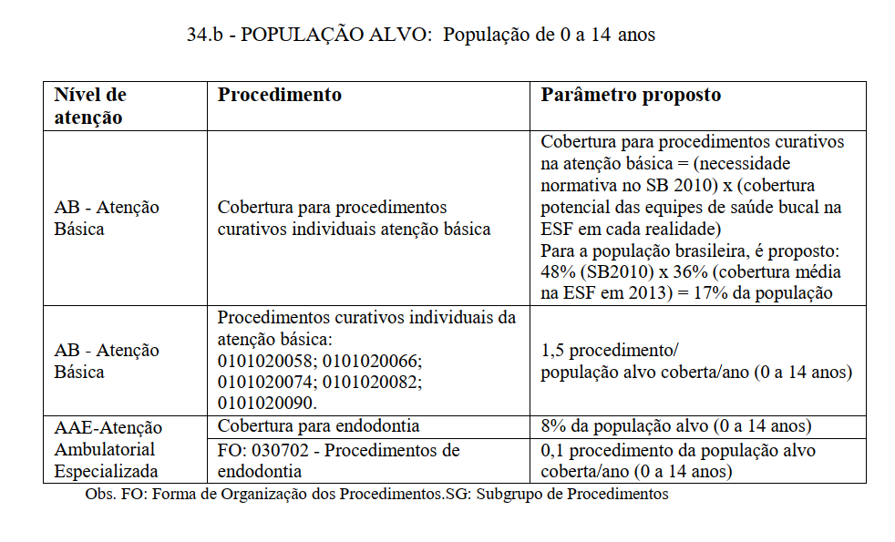
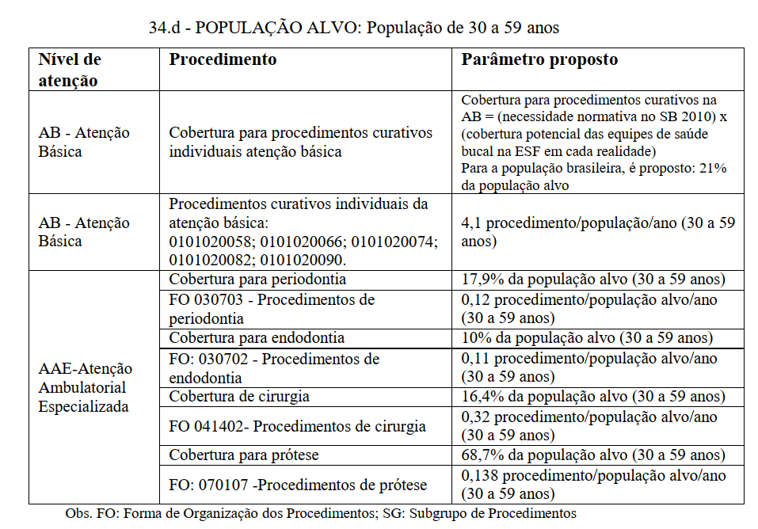
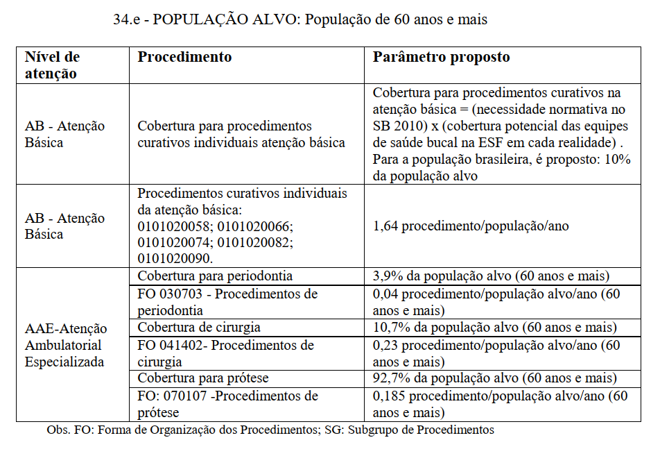

```{r setup, include=FALSE}

setwd("~/GitHub/dimensionamento/saude bucal")


options(scipen = 999)

knitr::opts_chunk$set(
	echo = TRUE,
	message = FALSE,
	warning = FALSE
)
library(tidyverse)
library(readxl)

if (!require(RODBC)) { install.packages(RODBC); require(RODBC) }

dremio_host <- "200.137.215.27"
dremio_port <- "31010"
dremio_uid <- "daniel"
dremio_pwd <- Sys.getenv("datalake")

channel <- odbcDriverConnect(sprintf("DRIVER=Dremio Connector;HOST=%s;PORT=%s;UID=%s;PWD=%s;AUTHENTICATIONTYPE=Basic Authentication;CONNECTIONTYPE=Direct", dremio_host, dremio_port, dremio_uid, dremio_pwd))

```

# Pressupostos teóricos 

O presente exercício tem como objetivo testar a aplicação de uma metodologia de planejamento da força de trabalho para a saúde bucal.

Essa é uma metodologia baseada em parâmetros de razão populacional (ex.: 1,5 procedimentos curativos para a população coberta) e utiliza como referência o [caderno de critérios e parâmetros para planejamento de serviços no âmbito do SUS (2017)](https://www.gov.br/saude/pt-br/acesso-a-informacao/gestao-do-sus/programacao-regulacao-controle-e-financiamento-da-mac/programacao-assistencial/arquivos/caderno-1-criterios-e-parametros-assistenciais-1-revisao.pdf). 

De acordo com o caderno de critérios e parâmetros temos algumas previsões sobre a necessidade de procedimentos. A imagem abaixo apresenta tais condições 






Diante dessas informações, depreende-se que alguns dados são necessários para a modelagem:

* Projeções populacionais: nesse caso, utilizaremos as projeções populacionais do IBGE a nível UF, por contarmos com dados até 2030 

* Cobertura de Estratégia de Saúde da Família Saúde Bucal: nesse caso, os dados foram acessados por meio do e-gestor AB 

# Baixando os dados da população 

Para essa metodologia serão necessários dados de população e da cobertura de estratégia de saúde - saúde bucal. 

```{r}

df_sb <- sqlQuery(channel, 'SELECT * FROM "Analytics Layer".Territorial."População IBGE por estado e faixa etária selecionada"')

df_cobertura <- read_delim("GitHub/dimensionamento/saude bucal/coberturasb_go.csv", 
    ";", escape_double = FALSE, trim_ws = TRUE)

DT::datatable(df_cobertura)

```


**Vamos utilizar o parâmetro de 24%. Porém, esse é um valor que deverá ser parametrizado no sistema.** 

# Prototipação

Para fins de prototipação, vamos pegar só dados de Goiás 

```{r}

a <- df_sb %>%  
  filter(uf == 'GO') %>% 
  ggplot(aes(x = ano, y = TOTAL, col = FAIXA_ETARIA)) + geom_line(size = 1) + 
  theme_minimal()

plotly::ggplotly(a)

```

# Calculando a necessidade em saúde bucal de cada grupo a cada ano 

## População de 0 a 14 anos
```{r}

df_sb0_14 <- 
  df_sb %>% 
  filter(uf == 'GO') %>% 
  filter(FAIXA_ETARIA == "0 a 14") %>% 
  mutate(cobertura = TOTAL * 0.24) %>% 
  mutate(proced_curativos = 1.5 * cobertura,
         cobertura_endodontia = 0.8 * cobertura,
         proced_endodontia = 0.1 * cobertura_endodontia) %>% 
  filter(ano > 2019) 

DT::datatable(df_sb0_14)

```

```{r}

b <- df_sb0_14 %>% 
  select(-uf, -FAIXA_ETARIA, -cobertura, -TOTAL, -cobertura_endodontia) %>% 
  pivot_longer(
               cols = starts_with("proced"),
               names_to = "procedimento",
               values_to = "total",
               ) %>% 
  ggplot(aes(x = ano, y = total, fill = procedimento)) + geom_col() + 
  theme_minimal()


plotly::ggplotly(b)


```


